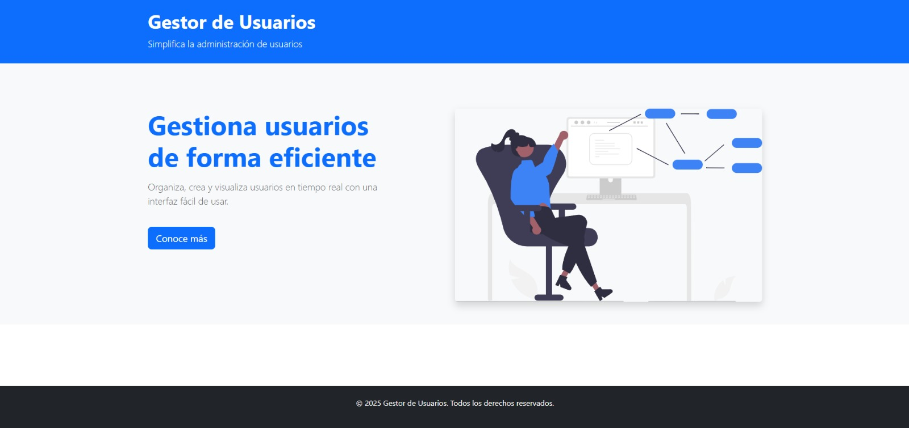
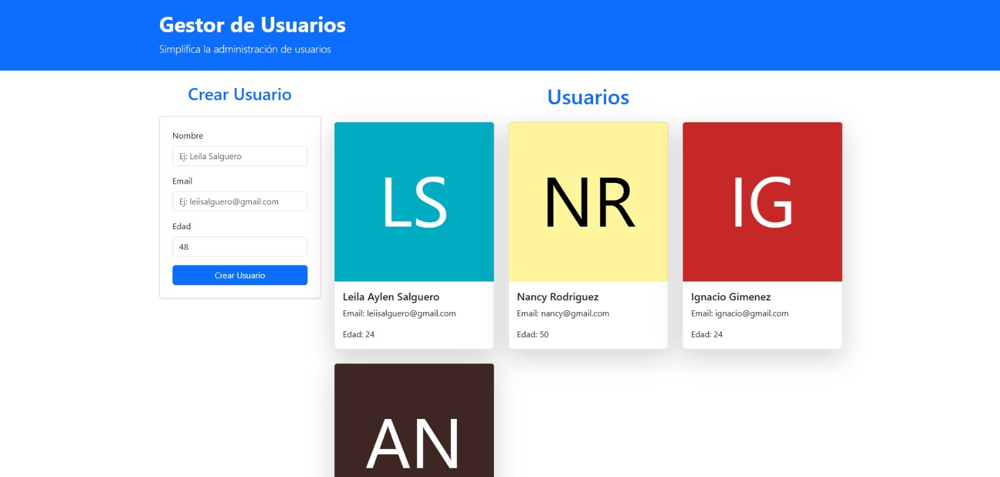

# 🌐 User Manager - Java & React

## 📌 About this project

This project implements a RESTful API for user management with the following endpoints as requested in the challenge:
- `GET /usuarios` - Retrieves the list of users.
- `POST /usuarios` - Creates a new user.

It also features a frontend created in React.js, with a user-friendly interface and Bootstrap styling.

- __Back End__: Java, Spring Boot.
- __Front End__: React.js, Bootstrap
- __Database__: This project does not have a connection to db, the data is stored in a List as requested

### 📌 How to get started?

This project requires a `.env` backend and frontend file in the root directory to configure your database and server.

#### Frontend Setup:

1. In the root directory, create the `.env` file for frontend configuration:
   - `VITE_API_URL=http://localhost:8080`

---

## 📍 To set up and run the project:

### Backend Setup:

1. Clone the repository and navigate to the `api` folder:
   ```bash
   cd api
   ```

2. Run the backend project:
   - For Maven:
     ```bash
     mvn clean install
     mvn spring-boot:run
     ```

### Frontend Setup:

1. Clone the repository and navigate to the `frontend` folder:
   ```bash
   cd frontend
   ```

2. Install dependencies:
   ```bash
   npm install
   ```

3. Start the frontend:
   ```bash
   npm run dev
   ```

---

## 📌 API Routes

### ⚡️ `GET /usuarios`
- Retrieves the list of all users.

**Response Example:**
```json
[
    {
        "id": 1,
        "name": "Leila Aylen",
        "email": "leiisalguero@gmail.com",
        "age": 30
    },
    {
        "id": 2,
        "name": "Juan Pérez",
        "email": "juanperez@gmail.com",
        "age": 25
    }
]
```

### ⚡️ `POST /usuarios`
- Creates a new user.

**Request Body Example:**
```json
{
    "name": "Leila Aylen",
    "email": "leiisalguero@gmail.com",
    "age": 30
}
```

**Response Example:**
```json
{
    "id": 3,
    "name": "Leila Aylen",
    "email": "leiisalguero@gmail.com",
    "age": 30
}
```

---

## 📌 Pages

### Home Page

The Home page is the main interface where users can view a list of all users in card format.

### 📸 Landing Page

The Landing page is a user-friendly entry point that introduces the user management application. It features a clean design with a welcome message and image.

<div align="center"> 
    </img>
</div>

## 📸 Home Page

The home screen displays a user creation form and a list of already created users 
<div align="center"> 
    </img>
</div>

---

## 📌 Technologies Used

- **Backend**: Java, Spring Boot
- **Frontend**: React.js, Bootstrap
- **API Requests**: Axios
- **Version Control**: Git, GitHub
